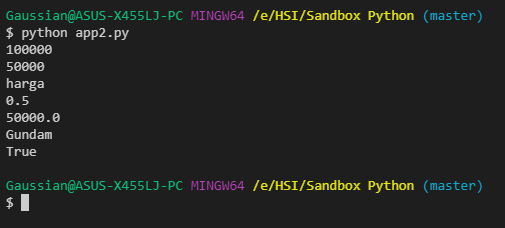
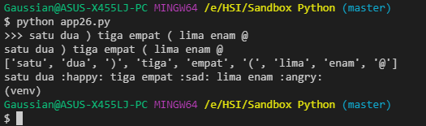
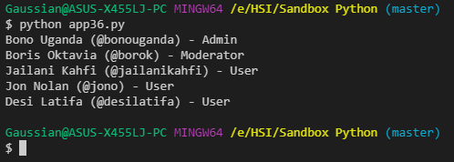

# Playground pelatihan magang HSI Sandbox - Tutorial Python Beginner (pn-level1)

Materi pembelajaran diambil dari [Youtube](https://www.youtube.com/watch?v=rWC2iFlN3TM)

## 1. Program Python Pertama
### Source code

```python
# 5:09 Program Python Pertama
# hello world
print("hello world")

# hello
print("hello")

# world
print("world")

# 100
print(100)

# Python Python Python 
print("Python " * 3) # bruh
```

### Output


## 2. Variabel dan Tipe Data
### Source code

```python
# 13:13 Variabel dan Tipe Data
price = 100000
print(price) # 100000

price = 50000
print (price) # 50000

price = "harga"
print (price) # harga

discount = 0.5
print (discount) # 0.5

price = 100000 * discount
print (price) # 50000.0

product_name = "Gundam"
print(product_name) # Gundam

is_discount = True
print (is_discount) # True


```

### Output



## 3. Menerima Input User
### Source code

```python
# 25:31 Menerima Input User
name = input("Siapa nama kamu? ")
hobby = input("Apa hobimu? ")
sentence = name + " Selamat belajar Python"
print (sentence)
print (name + " hobimu adalah " + hobby)
```

### Output


## 4. Type Conversion
### Source code

```python
# 31:04 Type Conversion
year = input("Tahun lahir : ")
print (type (year))

year = int(year)
print (type (year))

age = 2022 - year
print("Umur kamu : " + str(age))
```

### Output


## 5. String
### Source code

```python
# 39:56 String
name = "Bono 'Uganda'"
print(name)

print(name[6])
print(name[-2])
print(name[0:5])
print(name[:5])
print(name[5:13])
print(name[5:])
```

### Output


## 6. Formatted String
### Source code

```python
# 48:46 Formatted String
first_name = "Bono"
last_name = "Uganda"
message = first_name + " [" + last_name + "]"
print(message)

message = f"{first_name} [{last_name}]"
print(message)

age = 31
message = f"Umur kamu {age}"
print(message)
```

### Output


## 7. String Method
### Source code

```python
# 54:06 String Method
course = "Belajar Python Bareng Agung Setiawan"
length = len(course)
print (length)

course_capital = course.upper()
print(course_capital)

course_lowercase = course.lower()
print(course_lowercase)

print(course_lowercase.capitalize())
print(course_lowercase.title())
print(course.replace("Python", "Javascript"))

language = "Python"
print(language in course)

language = "Javascript"
print(language in course)
```

### Output


## 8. Matematika
### Source code

```python
# 1:04:24 Matematika
x = 10
y = 4
print (x + y) # addition
print (x - y) # subtraction
print (x * y) # multiplication
print (x / y) # division as float
print (x // y) # division as int
print (x ** y) # exponentiation
print (x % y) # modulus

x = x + 5
print(x)

x += 5
print(x)
x -= 5
print(x)

```

### Output


## 9. Operator Precedence
### Source code

```python
# 1:08:18 Operator Precedence
number = 2 + 10 * 5 ** 2
print(number)
```

### Output


## 10. Math Module
### Source code

```python
# 1:12:11 Math Module
import math

number = 5.8
number = round(number)
print(number)

number = 5.2
number = math.ceil(number)
print(number)

number = 5.9
number = math.floor(number)
print(number)
```

### Output


## 11. Percabangan If
### Source code

```python
# 1:16:43 Percabangan If
is_day = True
is_night = True
if is_day:
    print("Selamat siang")
elif is_night:
    print("Selamat malam")
else:
    print("Selamat suka-suka")

print ("Selamat menikmati harimu")

```

### Output


## 12. Operator Perbandingan
### Source code

```python
# 1:23:39 Operator Perbandingan
result = 4 > 3
print(result)

result = 4 > 3
print(result)

result = 4 >= 3
print(result)

result = 4 <= 3
print(result)

result = 4 == 3
print(result)

result = 4 == 4
print(result)

result = 4 != 4
print(result)

grade = 5
if grade >= 9:
    print("Nilai kamu A")
elif grade >= 7:
    print("Nilai kamu B")
elif grade >= 6:
    print("Nilai kamu C")
else:
    print("Silahkan belajar lagi dengan tekun")
```

### Output


## 13. Operator Logika
### Source code

```python
# 1:29:11 Operator Logika
name = "Bono Uganda"
by_pass_validation = False

if len(name) > 3 or by_pass_validation:
    print("Welcome")
else:
    print("Nama terlalu pendek")
```

### Output


## 14. Perulangan While
### Source code

```python
# 1:34:14 Perulangan While
index = 1

while index <= 5:
    print("*" * index)
    index += 1

print("Finish")
```

### Output


## 15. Game Tebak Angka
### Source code

```python
# 1:39:55 Game Tebak Angka
trying = 0
secret_number = 7
limit = 3

while trying < limit:
    guess_number = input("Masukkan angka (1-9) : ")
    guess_number = int(guess_number)

    if guess_number == secret_number:
        print("Selamat, anda menang")
        break

    trying += 1
```

### Output


## 16. Aplikasi Kalkulator
### Source code

```python
# 1:48:22 Aplikasi Kalkulator
# (! - * / exit)
command = ""

while command != "exit":
    command = input("Perintah : ")

    if command == "exit":
        break
    
    if command != "+" and command != "-" and command != "*" and command != "/":
        print("Perintah tidak dikenali")
        continue
    
    a = int(input("Angka pertama : "))
    b = int(input("Angka kedua : "))

    if command == "+":
        result = a + b
    elif command == "-":
        result = a - b
    elif command == "*":
        result = a * b
    elif command == "/":
        result = a / b

    print(f"Hasil : {result}")

print("Terima kasih sudah menggunakan aplikasi kami")
```

### Output


## 17. Perulangan For
### Source code

```python
# 2:00:17 Perulangan For
name = "Bono"
for i in name:
    print(i)

numbers = [1, 2, 3, 4, 5]
for val in numbers:
    print(val)

for item in range(1, 11, 2):
    print(item)
```

### Output


## 18. List
### Source code

```python
# 2:05:52 List
names = ["Bono", "Uganda", "Nababan", "Maul"]

print(names)
print(names[-1])
print(names[1:3])
print(names[1::2])

for name in names:
    print(f"Nama: {name}")
```

### Output


## 19. List Method
### Source code

```python
# 2:10:50 List Method
numbers = [5, 6, 7, 8, 1]

numbers.append(99)
print(numbers)

numbers.insert(3, 'aaa')
print(numbers)

numbers.remove('aaa')
print(numbers)

numbers.pop()
print(numbers)

numbers.pop(2)
print(numbers)

numbers.sort()
print(numbers)
```

### Output


## 20. Menjumlahkan List
### Source code

```python
# 2:15:30 Menjumlahkan List
numbers = [a ** 3 - 2 * a + 11 for a in range(8)]
print(sum(numbers))

total = 0
for item in numbers:
    total = total + item

print(total)
```

### Output


## 21. Mencari Angka Max
### Source code

```python
# 2:18:36 Mencari Angka Max
numbers = [8, 2, -8, 11, 4, 0, 9]
print(max(numbers))

highest = -1000000
for item in numbers:
    if item > highest:
        highest = item
print(highest)

highest = -1000000
for item in numbers:
    highest = max(highest, item)
print(highest)

numbers.sort()
print(numbers[-1])
```

### Output


## 22. Tuple
### Source code

```python
# 2:23:32 Tuple
array = [7, 6, 5, 4, 3]
array[0] = 10
print(array)

tuple = (7, 6, 5, 4, 3)
print(tuple)
print(tuple[4])
```

### Output


## 23. Unpack
### Source code

```python
# 2:27:03 Unpack
numbers = (5, 6, 7)
x = numbers[0]
y = numbers[1]
z = numbers[2]
print(f"{x} {y} {z}")

a, b, c = numbers
print(f"{a} {b} {c}")

numbers = [5, 6, 7]
p, q, r = numbers
# p, q = numbers # error: too many values to unpack
# p, q, r, s = numbers # error: not enough values to unpack
print(f"{p} {q} {r}")

r, _, _ = numbers
print(f"{p} {q} {r}")

r, *q = numbers
print(f"{p} {q} {r}")

numbers = (5, 6, 7)
r, *q = numbers
print(f"{p} {q} {r}")
```

### Output


## 24. Dictionary
### Source code

```python
# 2:32:24 Dictionary
user = {
    "name": "Bono Uganda",
    "age": 23,
    "is_admin": True
}

name = user["name"]
print(name)

if "name" in user:
    print(user["name"])
if "aaa" in user:
    print(user["aaa"])

print(user.get("name"))
print(user.get("aaa"))
print(user.get("aaa", "Name not found"))

user["gender"] = "male"
print(user)

user["age"] = 62
print(user)
```

### Output


## 25. Aplikasi Terbilang
### Source code

```python
# 2:40:06 Aplikasi Terbilang

numbers = input("Masukkan Angka : ")

numbers_mapping = {
    "1": "Satu",
    "2": "Dua",
    "3": "Tiga",
    "4": "Empat",
    "5": "Lima",
    "6": "Enam",
    "7": "Tujuh",
    "8": "Delapan",
    "9": "Sembilan"
}

output = ""

for n in numbers:
    terbilang = numbers_mapping.get(n, "Invalid")
    output = output + terbilang + " "

print(output)
```

### Output


## 26. Emoji Converter
### Source code

```python
# 2:45:57 Emoji Converter
message = input(">>> ")

emoji_mapping = {
    ")": ":happy:",
    "(": ":sad:",
    "@": ":angry:"
}

words = message.split(" ")
print(message)
print(words)

output = ""
for w in words:
    output = output + emoji_mapping.get(w, w) + " "

print (output)
```

### Output



## 27. Fungsi
### Source code

```python
# 2:52:50 Fungsi
def halo_user():
    print("Halo user")
    print("Selamat belajar Python")

print("Start")
halo_user()
print("Finish")
```

### Output


## 28. Parameter Fungsi
### Source code

```python
# 3:00:02 Parameter Fungsi
def halo_user(name = "user", level = 0):
    print(f"Halo {name} - {level}")
    print("Selamat belajar Python")

print("Start")
halo_user("Bono", 4)
print("=======================")
halo_user("Uganda", 2)
print("Finish")
```

### Output


## 29. Keyword Argument
### Source code

```python
# 3:04:52 Keyword Argument
def halo_user(name = "user", level = 0):
    print(f"Halo {name} - {level}")
    print("Selamat belajar Python")

print("Start")
halo_user(level = 10, name = "Bono")
print("Finish")
```

### Output


## 30. Return Value
### Source code

```python
# 3:09:40 Return Value
def multiply(a, b):
    return a * b

result = multiply(2, 10)
print(result)
```

### Output


## 31. Exception
### Source code

```python
# 3:16:16 Exception
try:
    level = input("Level kamu : ")
    level = int(level)
    level = level / 0
    print(level)
except ZeroDivisionError:
    print("Error tidak bisa dibagi 0")
except ValueError:
    print("Yang kamu masukkan itu bukan angka")
```

### Output


## 32. General Exception
### Source code

```python
# 3:21:01 General Exception
try:
    level = input("Level kamu : ")
    level = int(level)
    level = level / 0
    print(level)
except:
    print("Terjadi kesalahan")

```

### Output


## 33. Membaca File
### Source code

```python
# 3:21:55 Membaca File
users = open("data/users.txt", "r")

array = users.readlines()
print(array)

index = 1
for user in array:
    print(f"{index} -  {user}")
    index += 1

users.seek(0)

line = users.readline()
while line != "":
    print(line)
    line = users.readline()

users.close()
```

### Output


## 34. Menulis File
### Source code

```python
# 3:29:56 Menulis File
users = open("data/users_new.txt", "w")

users.write("Desi Latifa - desilatifa - User\n")

users.close()

users = open("data/users.txt", "a")

users.write("Desi Latifa - desilatifa - User\n")

users.close()
```

### Output

#### Sebelum


#### Setelah


## 35. Membaca CSV
### Source code

```python
# 3:35:49 Membaca CSV
import csv
users = open("data/users.csv", "r")

users_csv = csv.reader(users, delimiter = ",")

for name, username, role in users_csv:
    print(f"{name} (@{username}) - {role}")

users.seek(0)

for row in users_csv:
    print(f"Name : {row[0]}. Username : {row[1]}. Role : {row[2]}")

users.close()
```

### Output


## 36. With Block
### Source code

```python
# 3:41:16 With Block
import csv
with open("data/users.csv", "r") as users:
    users_csv = csv.reader(users, delimiter = ",")

    for name, username, role in users_csv:
        print(f"{name} (@{username}) - {role}")
```

### Output



## 37. Module
### Source code

```python
# 3:43:33 Module
import module.math as math
from module.math import minus

result = math.plus(10, 5)
print(result)

result = minus(10, 5)
print(result)
```

### Output


## 38. Package
### Source code

```python
# 3:48:24 Package
from module.sayer.affirmation import roger, ok
import module.sayer.cheers as cheers

roger()
ok()
cheers.hurrah()
cheers.yeah()
```

### Output


## 39. Random
### Source code

```python
# 3:52:41 Random
import random

print(random.random())
print(random.randint(10, 30))
characters = ['a', 'b', 'e', 'p', 'x', 't', 'y', 'm', 'i']

batas_bawah = 0
batas_atas = len(characters) - 1

random_int = random.randint(batas_bawah, batas_atas)
chosen = characters[random_int]

print(chosen)
print(random.choice(characters))
```

### Output


## 40. PIP dan Virtualenv
### Source code

```python
# 3:59:43 PIP dan Virtualenv
import cowsay

cowsay.cow("Saya sedang belajar Python")
```

### Output


